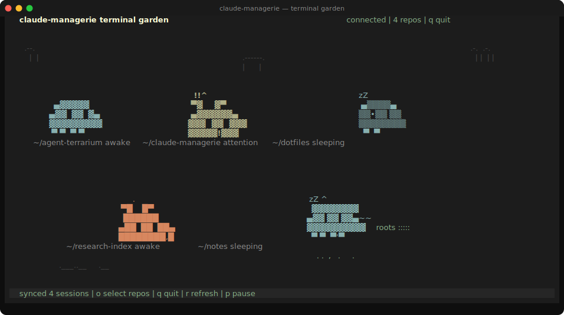
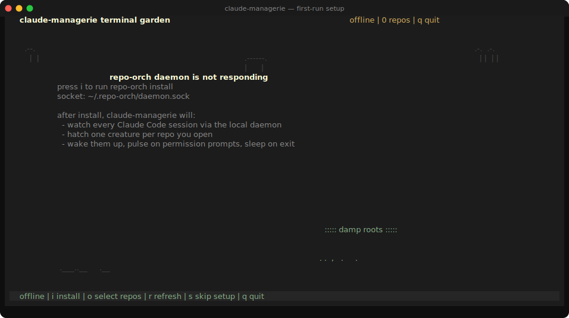
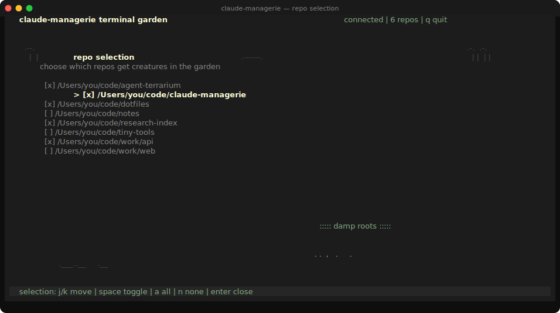

# claude-managerie

A terminal terrarium for your Claude Code sessions.

Every repo you open in Claude Code hatches a little creature in a shared
animated garden in your terminal. Creatures wake up when a session starts,
pulse when Claude is waiting on you, and curl up to sleep when the session
ends — so you can keep an eye on six parallel agents without alt-tabbing
through six tmux panes.



## How it works

claude-managerie is a small TypeScript TUI. It connects directly to the
[`agent-terrarium`][agent-terrarium] daemon over a local Unix socket
(`~/.repo-orch/daemon.sock`), subscribes to the canonical session event
stream, and renders a procedural ASCII creature per repo.

```
┌──────────────┐    hooks      ┌────────────────────┐   unix      ┌──────────────────┐
│  Claude Code │ ────────────▶ │ agent-terrarium     │  socket    │ claude-managerie │
│  (any repo)  │  transcripts  │ daemon (repo-orch)  │ ─────────▶ │      TUI         │
└──────────────┘               └────────────────────┘             └──────────────────┘
```

- **Observation only.** claude-managerie never writes inside your repos,
  never modifies `~/.claude/settings.json`, never makes network calls.
- **Local-first.** All state lives in `~/.repo-orch/` (daemon) and
  `~/.claude-managerie/config.json` (TUI preferences).
- **Dependency-light.** No browser, no Electron, no Tauri, no Vite.
  TypeScript + Vitest, plus a hand-rolled ANSI renderer.

[agent-terrarium]: https://github.com/rks277/agent-terrarium

---

## Install

One command. macOS only.

```sh
git clone https://github.com/rks277/claude-managerie.git
cd claude-managerie && ./bootstrap.sh
```

`bootstrap.sh` clones [agent-terrarium](https://github.com/rks277/agent-terrarium)
as a sibling (or uses `AGENT_TERRARIUM_ROOT` if set), builds both repos,
loads the launchd daemon, registers the Claude Code plugin, installs a
global `claude-managerie` command on your PATH, and drops you into the
garden. Re-running the script is safe — every step is idempotent.

After bootstrap, day-to-day use is just:

```sh
claude-managerie         # open the garden from any terminal
claude-managerie update  # git pull + rebuild both repos, restart daemon
claude-managerie doctor  # check daemon health
claude-managerie setup   # re-run setup (idempotent)
```

### What gets written to your machine

- `~/.repo-orch/` — daemon state (DB, socket, logs).
- `~/Library/LaunchAgents/co.repo-orch.daemon.plist` — launchd job.
- `~/.claude/plugins/repo-orch/` — Claude Code hook plugin (source tree).
- `~/.claude-managerie/config.json` — TUI preferences (selected repos, creature identities).

Plugin registration is performed by invoking the official `claude plugin
marketplace add` and `claude plugin install` subcommands — claude-managerie
does **not** touch `~/.claude/settings.json` or the other plugin registry
files directly. Claude Code writes whatever it writes, exactly as it would
if you ran the slash commands manually.

<details>
<summary><strong>Manual install (advanced)</strong></summary>

If `bootstrap.sh` doesn't suit you, the original four-step flow still
works:

#### Prerequisites

- Node.js ≥ 20
- pnpm (`npm i -g pnpm` or Corepack)
- Claude Code ([install](https://docs.claude.com/en/docs/claude-code))
- macOS (Linux not yet supported)

#### Install and build agent-terrarium

```sh
git clone https://github.com/rks277/agent-terrarium.git
cd agent-terrarium
pnpm install
pnpm -r build
node packages/cli/dist/index.js install
node packages/cli/dist/index.js doctor
```

#### Install claude-managerie

```sh
cd ..
git clone https://github.com/rks277/claude-managerie.git
cd claude-managerie
npm install
npm run dev
```

If agent-terrarium lives elsewhere, set `AGENT_TERRARIUM_ROOT=/absolute/path`.

#### Register the Claude Code plugin

Inside any Claude Code session, paste:

```
/plugin marketplace add ~/.claude/plugins/repo-orch
/plugin install repo-orch@repo-orch
```

</details>

---

## First-run setup

If the daemon isn't running yet, the TUI opens in setup mode and tells
you what's missing:



From here:

- `i` — runs `repo-orch install` for you (same as the manual step above)
- `r` — re-checks daemon status after you've fixed something externally
- `s` — skips setup for this session if you just want to look around

Once the daemon responds to a `ping`, the TUI flips into garden mode.

---

## Day-to-day use

Open Claude Code in any repo. Within a second or two a creature appears
in the garden:

- **Awake** — Claude is actively responding.
- **Attention** (pulsing, label flashes) — Claude is waiting on you, e.g.
  a permission prompt or a question.
- **Sleeping** — the session is idle or has ended.

Press `o` (or `Enter`) to pick which repos appear in the garden:



### Keyboard reference

| Key       | Action                                                        |
|-----------|---------------------------------------------------------------|
| `o` / `↵` | open/close repo selection                                     |
| `j` / `k` | move cursor in repo selection                                 |
| `space`   | toggle the highlighted repo                                   |
| `a`       | show all repos                                                |
| `n`       | hide all repos                                                |
| `p`       | pause / resume animation                                      |
| `r`       | refresh daemon state                                          |
| `i`       | run `repo-orch install` (when setup is offline)               |
| `s`       | mark setup skipped for this session                           |
| `q`       | quit                                                          |

Repo selection is persisted to `~/.claude-managerie/config.json`, along
with each repo's stable creature identity — so the creature for a given
repo looks the same across runs.

---

## Development

```sh
npm run dev         # build + run the TUI
npm run lab         # render every creature archetype side-by-side
npm run lab /abs/path/to/repo-a /abs/path/to/repo-b   # specific repos

npm run typecheck   # tsc --noEmit
npm test            # vitest run (pure unit tests for state + generator)
npm run build       # emit dist/
```

The creature lab is the fastest way to iterate on sprite art and
palettes — it skips the daemon entirely and renders archetypes straight
to stdout.

### Project layout

```
src/
  main.ts                 # tiny entry: starts ManagerieApp, handles SIGINT/SIGTERM
  types.ts                # shared session/event types
  tui/
    app.ts                # ManagerieApp: keyboard, render loop, sync loop
    renderer.ts           # TerminalGarden: grid, physics, sprite placement
    ansi.ts               # 256-color palette + escape sequences
  creatures/
    generator.ts          # archetypes, variant/mark/palette mixing
    generator.test.ts     # determinism + identity tests
  repo-orch/
    paths.ts              # resolves ~/.repo-orch, ~/.claude/plugins, ../agent-terrarium
    socket-client.ts      # JSON-lines client over the daemon's Unix socket
    install.ts            # spawns repo-orch install / doctor as a child process
  state/
    session-store.ts      # event aggregation -> RepoCreature[]
    config-store.ts       # ~/.claude-managerie/config.json
  dev/
    creature-lab.ts       # standalone sprite renderer (npm run lab)
scripts/
  render-screenshots.mjs  # regenerates docs/images/*.svg
docs/images/              # SVG screenshots committed for the README
```

### Regenerating screenshots

The images in this README are SVGs produced from the same sprite data
that the TUI uses. To regenerate them after changing sprite art or
palette colors:

```sh
node scripts/render-screenshots.mjs
```

The script is self-contained — it mirrors the sprite data and inlines
the 256-color → hex mapping, so it runs without a build step.

---

## Troubleshooting

**`repo-orch daemon is not responding`**
Run `node /path/to/agent-terrarium/packages/cli/dist/index.js doctor`.
If the socket is missing, run `... install`. If the daemon is dead, the
launchd job will restart it within a minute, or you can `... install`
again to force-restart.

**`agent-terrarium CLI is not built`**
The TUI is looking for `../agent-terrarium/packages/cli/dist/index.js`.
Run `pnpm install && pnpm -r build` in the agent-terrarium checkout, or
set `AGENT_TERRARIUM_ROOT` to the right path.

**Daemon online, no sessions yet**
You haven't registered the Claude Code plugin yet, or you haven't opened
a Claude Code session since registering it. Re-do step 4 above and start
a session in any repo.

**Creature for a repo looks wrong / I want a redraw**
Delete its entry from `~/.claude-managerie/config.json` under
`creatureIdentities` and restart the TUI — it'll re-derive the identity
from the repo path.

---

## Scope

claude-managerie is intentionally small. v1 is observation-only: there
is no browser server, no remote control of sessions, no telemetry, no
per-creature stats panel. The daemon already stores everything (token
counts, tool use, transcripts), so future versions can layer on richer
views without changing the install story.
